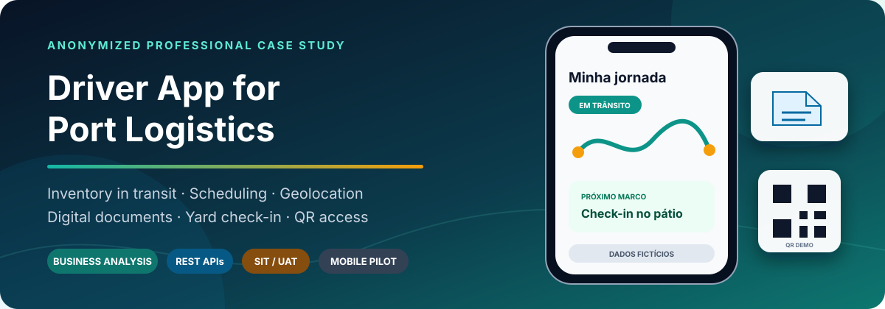
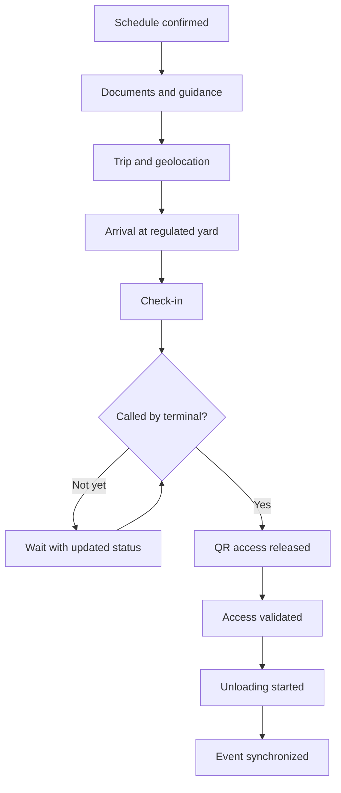
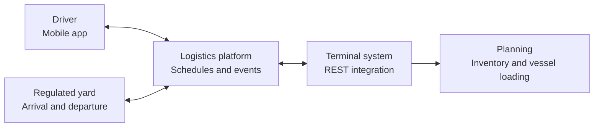

  

  <a href="README.md">Português</a> · <a href="README.en.md">English</a>

# Driver App for Port Logistics

An anonymized case study on **business analysis, systems integration and software quality** for a mobile solution connecting truck drivers to an export terminal operation.

The project covered scheduling, reminders, route guidance, digital documents, geolocation, regulated yard check-in, terminal call-up, QR access and unloading status. Its key business purpose was to improve visibility of **inventory in transit** before physical receipt at the terminal.

> This portfolio reconstruction is based on a real project. Client identity, production data, screens, contracts, endpoints and internal documents are not included.

| Scope | My role | Domain |
|---|---|---|
| Mobile app + REST integrations | Requirements, business rules, refinement, SIT, UAT, pilot, acceptance and hypercare | Export port terminal |
| Scheduling, route, documents and QR access | Functional and end-to-end validation | Trizy / nstech ecosystem |
| In-transit inventory and logistics events | Translation of operational needs into flows and acceptance criteria | Road-to-port journey |

## Business challenge

Planning an export operation requires more than knowing what is already stored inside the terminal. Cargo may be committed to a vessel while still at origin, on the road or waiting in a regulated yard. Without reliable journey events, the operation has limited predictability.

The solution turned physical milestones into digital events, linking the driver app, logistics platform, yards and terminal system. It enabled a qualified view of in-transit inventory while simplifying the driver's access to schedules, instructions and operational documents.

## End-to-end journey

## Solution context

Arrows represent logical data exchanges. Internal topology, endpoints, payloads and authentication mechanisms were intentionally removed.

## My contribution

- Business need discovery and operational flow analysis.
- AS-IS / TO-BE mapping and integration-point identification.
- Functional requirements, business rules and acceptance criteria.
- Refinement with the provider and development follow-up.
- REST/JSON integration validation and response handling.
- Functional, negative, mobile and QR Code test scenarios.
- SIT, UAT and a pilot on a corporate mobile device.
- Defect reporting, prioritization, retesting and acceptance.
- Go-live support and post-release hypercare.

I do not claim authorship of the application's source code or third-party platform. My authorship in this case is the **business analysis, functional specification, integration validation, quality work and acceptance coordination**.

## Value enabled

No confidential client metrics are published. The outcomes below are capabilities enabled by the solution:

- improved visibility of cargo not yet physically received;
- traceability across origin, road, yard and terminal milestones;
- better synchronization between queue, capacity and call-up;
- digital access to transport and release documents;
- fewer manual contacts and less paper circulation;
- an event foundation for logistics and vessel-loading planning;
- an auditable trail for exceptions and operational support.

## Skills demonstrated

`Business Analysis` · `Requirements Engineering` · `BPMN` · `AS-IS / TO-BE` · `REST APIs` · `JSON` · `SIT` · `UAT` · `Mobile Testing` · `QR Code` · `Geolocation` · `Supply Chain` · `Port Operations` · `Go-live` · `Hypercare`

Detailed documentation is available in Portuguese from the [main README](README.md).

## Author

**Laís Moreira** — Business Analyst | Systems, Data, Processes and Integrations 
[LinkedIn](https://www.linkedin.com/in/lais-moreira-lm1698/)
