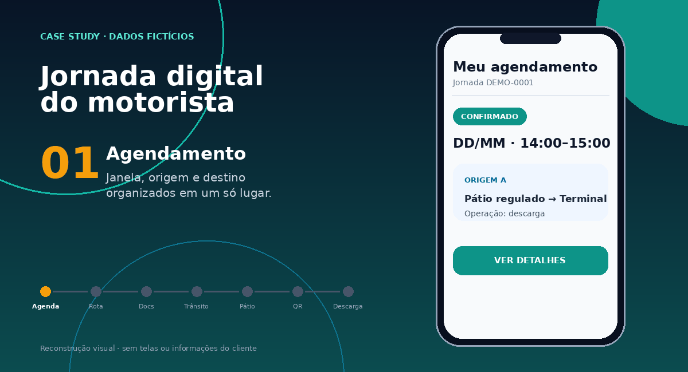
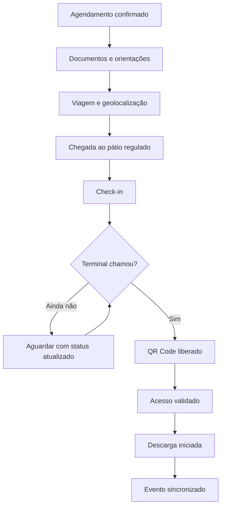
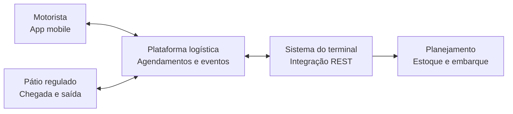
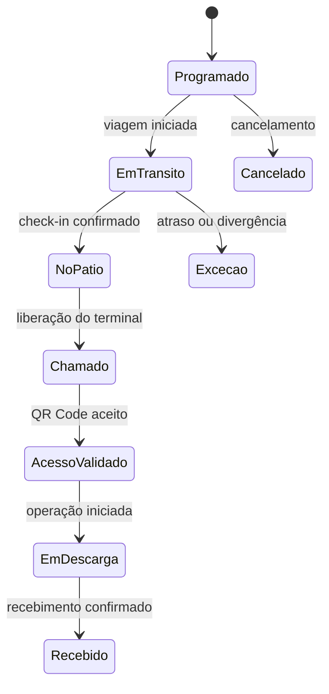

  

  <a href="README.md">Português</a> · <a href="README.en.md">English</a>

# Aplicativo de Motoristas para Logística Portuária

Case study anonimizado de **Business Analysis, integrações e qualidade de software** em uma solução mobile para logística rodoviária-portuária.

O projeto conectou a jornada do motorista ao planejamento do terminal: agendamento, lembretes, rota, documentos digitais, geolocalização, direcionamento a pátio regulado, check-in, chamada do terminal, QR Code de acesso e início da descarga.

> Este repositório é uma reconstrução de portfólio baseada em um projeto real. Cliente, dados, telas, contratos, endpoints e documentos internos foram omitidos ou substituídos por conteúdo fictício.

| Escopo | Minha atuação | Contexto |
|---|---|---|
| App mobile + integrações REST | Requisitos, regras, refinamento, SIT, UAT, piloto, homologação e hypercare | Terminal portuário de exportação |
| Agendamento, rota, documentos e QR Code | Validação funcional e de ponta a ponta | Plataforma Trizy / ecossistema nstech |
| Estoque em trânsito e eventos logísticos | Tradução da necessidade operacional em fluxos e critérios de aceite | Jornada rodoviária-portuária |

## Resumo executivo

O planejamento de uma operação de exportação não depende somente do estoque já recebido fisicamente no terminal. Parte da carga comprometida com o embarque ainda está na origem, em deslocamento ou aguardando liberação em um pátio regulado. Sem eventos confiáveis dessa jornada, a operação perde previsibilidade.

A solução integrou aplicativo de motoristas, plataforma logística, pátios e sistema do terminal para transformar etapas físicas em eventos digitais. O resultado foi uma visão operacional mais completa do **estoque em trânsito**, combinada a uma experiência mais simples para o motorista e a menor dependência de documentos em papel.

## O problema de negócio

- Visibilidade parcial da carga antes da chegada física ao terminal.
- Dependência de contatos manuais para confirmar posição, status e previsão de chegada.
- Informações operacionais e documentos dispersos ao longo da jornada.
- Necessidade de sincronizar agendamento, pátio de espera, chamada e acesso ao terminal.
- Risco de acesso fora da janela, QR Code inválido, divergência cadastral ou falta de liberação.
- Necessidade de apoiar uma operação mais digital, rastreável e com menor circulação de papel.

## A solução funcional

  

> Demonstração conceitual criada com dados fictícios. Não reproduz telas, identidade visual nem dados do ambiente produtivo.

| Momento | Experiência do motorista | Informação para a operação |
|---|---|---|
| Planejamento | Consulta ao agendamento e à janela operacional | Carga prevista e compromisso de chegada |
| Preparação | Lembretes, origem, destino, rota e orientações | Redução de dúvidas e contatos paralelos |
| Viagem | Compartilhamento de localização e eventos | Posição, status e previsão operacional |
| Pré-chegada | Direcionamento ao pátio regulado | Organização do fluxo externo ao terminal |
| Check-in | Confirmação de chegada ao pátio | Atualização do marco logístico |
| Chamada | Notificação de liberação pelo terminal | Sincronização entre capacidade e fila |
| Acesso | QR Code habilitado para validação | Controle de elegibilidade e rastreabilidade |
| Operação | Início da descarga e atualização de status | Transição do trânsito para o recebimento físico |

## Jornada ponta a ponta

## Visão da solução

As setas representam trocas lógicas de dados. Nomes internos, topologia, endpoints, payloads e mecanismos de autenticação foram deliberadamente removidos.

## Estoque em trânsito como informação de planejamento

Neste case, **estoque em trânsito** é a carga comprometida com a operação, porém ainda não recebida fisicamente no terminal. A solução não confunde localização do veículo com entrada em estoque: cada marco possui significado próprio.

Essa separação permite que o planejamento trabalhe com três visões distintas:

1. **Estoque físico:** carga efetivamente recebida.
2. **Estoque em trânsito qualificado:** carga ativa, associada a agendamento e eventos válidos.
3. **Exceções:** atrasos, cancelamentos, divergências ou perda de atualização que exigem análise.

## Minha contribuição

Atuei funcionalmente de ponta a ponta, conectando operação, tecnologia, fornecedor e usuários:

- levantamento da necessidade e entendimento do fluxo operacional;
- mapeamento AS-IS / TO-BE e identificação de pontos de integração;
- especificação de requisitos funcionais, regras de negócio e critérios de aceite;
- refinamento com fornecedor e acompanhamento do desenvolvimento;
- validação de integrações REST, estruturas JSON e tratamento de retornos;
- elaboração e execução de testes funcionais e cenários negativos;
- testes de QR Code, agendamento, documentos, status e comportamento mobile;
- SIT, UAT e piloto em dispositivo corporativo, reproduzindo a jornada do motorista;
- registro, priorização, reteste e aceite de correções;
- apoio ao go-live e acompanhamento em hypercare.

Não reivindico autoria sobre o código-fonte ou sobre a plataforma utilizada. Minha autoria neste case está na **análise de negócio, especificação funcional, validação das integrações, qualidade e condução da homologação**.

## Estratégia de qualidade

A validação foi organizada em camadas:

| Camada | Foco |
|---|---|
| Requisito | Rastreabilidade entre necessidade, regra e critério de aceite |
| Funcional | Fluxos positivos, negativos, obrigatoriedade e mensagens |
| Integração | Eventos, payloads, respostas, duplicidade, falha e reprocessamento |
| Mobile | Permissões, navegação, QR Code, documentos e conectividade |
| SIT | Comunicação entre aplicativo, plataforma, pátio e terminal |
| UAT | Aderência à operação e linguagem compreensível ao usuário |
| Piloto | Uso em aparelho real e confronto entre processo esperado e observado |
| Pós-go-live | Monitoramento de incidentes, correções e estabilização |

Veja a [estratégia detalhada](docs/04-quality-strategy.md) e os [cenários de teste demonstrativos](examples/test-scenarios.csv).

## Valor habilitado pela solução

Como não são publicados indicadores internos do cliente, os resultados abaixo descrevem capacidades habilitadas, e não percentuais de ganho:

- maior previsibilidade sobre a carga ainda não recebida;
- rastreabilidade dos marcos entre origem, estrada, pátio e terminal;
- melhor sincronização entre fila, capacidade operacional e chamada;
- acesso digital a documentos de transporte, liberação e operação;
- redução de contatos manuais e circulação de documentos físicos;
- experiência mais orientada ao motorista, com informações em um único canal;
- base de eventos para planejamento logístico e acompanhamento do embarque;
- trilha auditável para investigação de divergências e suporte operacional.

## Competências demonstradas

`Business Analysis` · `Requirements Engineering` · `BPMN` · `AS-IS / TO-BE` · `REST APIs` · `JSON` · `Postman / Insomnia` · `SIT` · `UAT` · `Mobile Testing` · `QR Code` · `Geolocation` · `Logistics` · `Port Operations` · `Go-live` · `Hypercare`

## Como explorar o repositório

| Documento | Conteúdo |
|---|---|
| [Contexto e problema](docs/01-business-context.md) | Necessidade, objetivos, stakeholders e recorte do case |
| [Jornada e requisitos](docs/02-driver-journey-and-requirements.md) | Fluxo do motorista e capacidades funcionais |
| [Solução e integrações](docs/03-solution-and-integrations.md) | Contexto técnico, eventos e responsabilidades |
| [Estratégia de qualidade](docs/04-quality-strategy.md) | SIT, UAT, piloto, testes e rastreabilidade |
| [Piloto ao hypercare](docs/05-pilot-go-live-hypercare.md) | Validação em campo, implantação e estabilização |
| [Paperless e sustentabilidade](docs/06-paperless-and-sustainability.md) | Contribuições, limites e indicadores sugeridos |
| [Evidências de atuação](docs/07-evidence-map.md) | Relação entre competências e entregáveis |
| [Requisitos funcionais](examples/functional-requirements.md) | Amostra anonimizada de requisitos e aceites |
| [Regras de negócio](examples/business-rules.md) | Regras conceituais reconstruídas para o portfólio |
| [Eventos de integração](examples/conceptual-events.json) | Payload fictício, sem contrato proprietário |
| [Checklist de UAT](examples/uat-checklist.md) | Critérios demonstrativos para aceite |

## Limites de confidencialidade

Não fazem parte deste repositório:

- nome do cliente e nomes de colaboradores;
- proposta comercial, valores ou documentos contratuais;
- gravação original do protótipo e capturas de tela produtivas;
- QR Codes, documentos fiscais, placas, rotas ou localizações reais;
- especificações proprietárias, credenciais, tokens, URLs ou payloads internos;
- código-fonte, configuração de infraestrutura ou dados de produção.

Consulte o [aviso de confidencialidade e autoria](DISCLAIMER.md).

## Sobre a expressão “paperless port”

Neste repositório, a expressão descreve a **digitalização da jornada rodoviária-portuária e a redução do uso de papel**. Ela não afirma integração formal com o sistema governamental Porto Sem Papel (PSP). Essa distinção evita confundir uma diretriz de processo sustentável com um sistema regulatório específico.

## Autora

**Laís Moreira** — Business Analyst | Sistemas, Dados, Processos e Integrações 
[LinkedIn](https://www.linkedin.com/in/lais-moreira-lm1698/)

---

Se este case chegou até você em um processo seletivo, a melhor leitura é: **transformei uma necessidade operacional complexa em requisitos, integrações testáveis e uma jornada digital homologada em ambiente real**.
