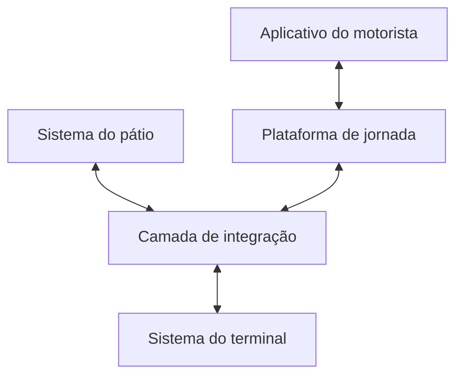
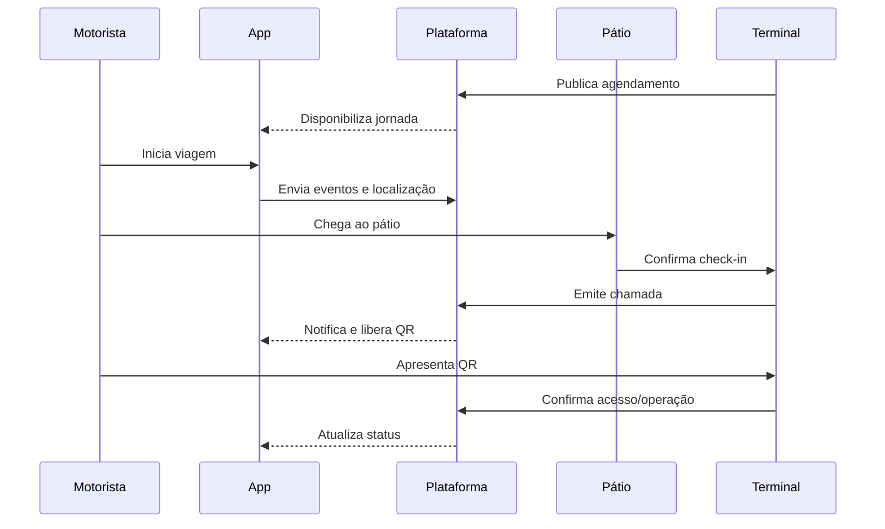

# 03. Solução e integrações

[← Voltar ao README](../README.md)

## Contexto lógico

| Componente | Responsabilidade lógica |
|---|---|
| Aplicativo do motorista | Experiência mobile, notificações, documentos, localização e QR Code |
| Plataforma de jornada | Agendamentos, identidade da operação, etapas e comunicação |
| Sistema do pátio | Registro de chegada, permanência e saída no local regulado |
| Camada de integração | Transformação, validação, correlação e tratamento de falhas |
| Sistema do terminal | Capacidade, chamada, acesso, operação e informação de planejamento |

O diagrama é deliberadamente conceitual. Não representa a topologia, os nomes de produtos internos ou os contratos reais.

## Sequência principal

## Catálogo conceitual de eventos

| Evento | Produtor lógico | Consumidor lógico | Efeito esperado |
|---|---|---|---|
| `SchedulePublished` | Terminal | Plataforma/App | Jornada aparece para o motorista |
| `TripStarted` | App | Plataforma/Terminal | Carga passa a ter evento de deslocamento |
| `LocationUpdated` | App | Plataforma | Posição e recência são atualizadas |
| `YardArrivalConfirmed` | Pátio | Terminal/Plataforma | Veículo passa ao estado “no pátio” |
| `TerminalCallReleased` | Terminal | Plataforma/App | Motorista é autorizado a prosseguir |
| `AccessCredentialIssued` | Plataforma | App/Gate | QR Code fica disponível |
| `TerminalAccessValidated` | Terminal | Plataforma | Credencial é consumida e acesso registrado |
| `UnloadingStarted` | Terminal | Planejamento/Plataforma | Operação passa ao estado “em descarga” |
| `CargoReceived` | Terminal | Planejamento | Carga pode compor o estoque físico conforme regra |
| `JourneyExceptionRaised` | Qualquer componente | Suporte/Operação | Exceção é registrada e tratada |

Os nomes acima foram criados para o portfólio. Não correspondem necessariamente a endpoints ou mensagens da solução original.

## Fonte de verdade por informação

| Informação | Fonte lógica recomendada | Observação |
|---|---|---|
| Agendamento e janela | Sistema do terminal | Regra operacional de atendimento |
| Identidade do motorista | Cadastro autorizado da plataforma | Deve respeitar proteção de dados |
| Veículo da operação | Agendamento/cadastro validado | Alteração exige nova validação |
| Posição móvel | Aplicativo/plataforma | Tem recência e precisão; não prova recebimento |
| Entrada/saída do pátio | Sistema do pátio | Evento físico do local regulado |
| Chamada | Sistema do terminal | Expressa capacidade e autorização operacional |
| QR Code | Plataforma sob autorização do terminal | Credencial temporária, não cadastro mestre |
| Recebimento físico | Sistema do terminal | Não deve ser inferido apenas pela localização |

## Princípios de integração

### Correlação

Cada jornada precisa de um identificador técnico não sensível que conecte agendamento, eventos, chamadas e logs. Dados pessoais não devem ser usados como chave de correlação.

### Idempotência

Eventos móveis e chamadas de sistemas externos podem ser reenviados. Repetir uma requisição com o mesmo identificador não deve duplicar check-in, acesso ou recebimento.

### Ordem e temporalidade

Todo evento crítico deve carregar instante de ocorrência, instante de processamento e fuso/UTC. O consumidor deve decidir o que fazer com eventos atrasados ou fora de ordem.

### Segurança

- autenticação e autorização entre sistemas;
- segregação entre ambientes;
- segredos fora de código, documentos e exemplos;
- criptografia em trânsito;
- menor privilégio para documentos e localização;
- expiração e revogação da credencial de acesso;
- logs sem conteúdo sensível desnecessário.

### Resiliência

- timeout e retentativa com limite;
- fila ou mecanismo de reprocessamento quando aplicável;
- tratamento explícito de indisponibilidade;
- mensagem ao usuário sem revelar detalhes internos;
- reconciliação de estados após retorno da conexão.

### Observabilidade

Uma investigação deve responder: qual jornada falhou, em qual etapa, qual sistema produziu o evento, quantas tentativas ocorreram e qual estado ficou vigente.

## Dados mínimos por evento

O exemplo público usa somente dados fictícios e está em [`examples/conceptual-events.json`](../examples/conceptual-events.json). Os campos demonstram princípios, não um contrato copiável:

- `eventId` para idempotência;
- `correlationId` para rastreabilidade;
- `eventType` e `occurredAt` para semântica e ordem;
- identificadores fictícios da jornada e do agendamento;
- estado anterior e novo estado;
- origem do evento e versão do esquema.

## Privacidade da geolocalização

Geolocalização é dado pessoal e operacional. A solução deve explicitar finalidade, momento de início e término, acesso, retenção e tratamento quando o motorista nega permissão. O case demonstra essa preocupação funcional, mas não publica a política interna do cliente.
