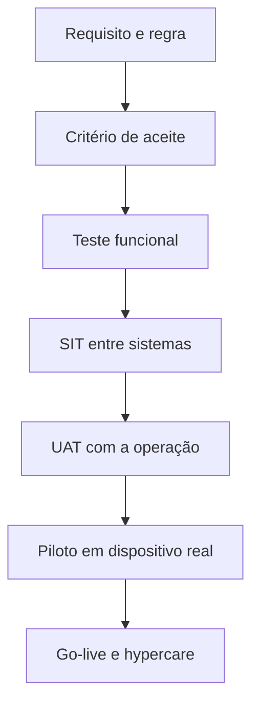
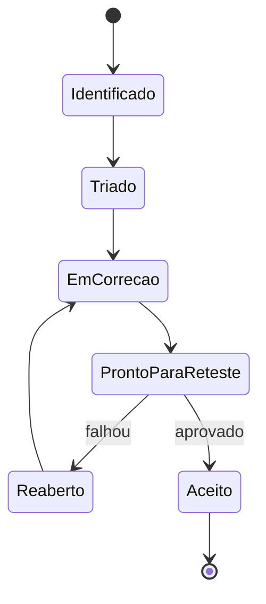

# 04. Estratégia de qualidade

[← Voltar ao README](../README.md)

## Objetivo

Validar não apenas se cada tela funciona, mas se a cadeia completa preserva a regra de negócio entre aplicativo, plataforma, pátio e terminal.

## Abordagem

## Camadas de teste

| Camada | Questão respondida | Exemplos |
|---|---|---|
| Estática | O requisito é claro, testável e consistente? | revisão de regras e critérios |
| Funcional | O recurso se comporta como especificado? | agendamento, documentos, mensagens |
| Negativa | A solução bloqueia o que não deveria ocorrer? | QR antecipado, janela inválida |
| Integração | Os sistemas trocam eventos corretamente? | check-in, chamada, atualização de status |
| Mobile | O fluxo funciona no contexto real do aparelho? | permissões, conectividade, visualização |
| Segurança funcional | O usuário acessa apenas o que lhe pertence? | jornada, documento, QR e sessão |
| Regressão | Uma correção não quebrou os fluxos essenciais? | smoke test do caminho crítico |
| UAT | A solução atende à rotina e à linguagem da operação? | aceite por cenário de negócio |
| Piloto | O comportamento se sustenta fora do ambiente controlado? | dispositivo e rede corporativos |

## Rastreabilidade

Cada cenário deve apontar para uma necessidade, uma regra e um resultado esperado.

| Necessidade | Requisito | Regra | Cenário | Evidência | Resultado |
|---|---|---|---|---|---|
| Acesso somente após chamada | FR-014 | BR-008 | TC-014 | captura/log sanitizado | Aprovado/Reprovado |

O identificador é demonstrativo. A matriz original não é publicada.

## Foco especial: QR Code

O QR Code representa uma autorização operacional, não apenas uma imagem. Por isso, a validação deve cobrir:

- indisponível antes da chamada;
- disponível após chamada válida;
- associação ao agendamento correto;
- leitura no equipamento homologado;
- expiração por tempo ou mudança de estado;
- bloqueio após consumo quando a regra exigir uso único;
- revogação após cancelamento;
- rejeição de captura antiga ou credencial de outra jornada;
- mensagem clara em caso de falha;
- trilha de auditoria da emissão e da validação.

## Foco especial: integrações

Para cada evento, validar:

- contrato e campos obrigatórios;
- autenticação e autorização;
- códigos de resposta e mensagem funcional;
- consistência de data, hora e fuso;
- duplicidade e idempotência;
- evento fora de ordem;
- timeout, retentativa e reprocessamento;
- correlação entre requisição e jornada;
- proteção de conteúdo sensível nos logs;
- atualização final no app e no sistema do terminal.

## Foco especial: documentos

- documento pertence à jornada ativa;
- usuário está autorizado;
- nome e tipo são compreensíveis;
- arquivo abre no aparelho homologado;
- versão atual substitui ou identifica a anterior;
- falha de download é tratada;
- conteúdo não permanece exposto em logs;
- expiração ou revogação são respeitadas.

## SIT

O SIT verifica o percurso completo do dado. Um fluxo só é aprovado quando o evento produzido em uma ponta gera o estado esperado na outra.

Exemplo: a confirmação de chegada no pátio deve ser recebida, validada, correlacionada ao agendamento, refletida no status e disponibilizada para a operação sem duplicar o evento em caso de reenvio.

## UAT

O UAT foi orientado por situações reais e linguagem operacional. O aceite considera:

- tarefa concluída pelo usuário sem interpretação técnica;
- status exibido coerente com a realidade;
- mensagens acionáveis;
- documentos e orientações corretos;
- exceções conhecidas com caminho de tratamento;
- ausência de defeito crítico ou alto sem mitigação aprovada.

## Piloto mobile

O piloto em aparelho corporativo aproximou o teste do contexto do motorista. Foram observados, entre outros pontos:

- instalação, autenticação e permissões;
- legibilidade e navegação;
- comportamento ao alternar entre app e visualizador de documentos;
- acesso ao agendamento e ao QR Code;
- abertura de arquivos;
- resposta a conexão móvel instável;
- diferença entre comportamento esperado e observado;
- necessidade de correção, reteste ou orientação.

## Ciclo de defeito

Um registro útil contém cenário, pré-condição, passos, esperado, observado, evidência, ambiente, versão, severidade e impacto operacional.

## Critérios de saída

- caminho crítico aprovado em SIT e UAT;
- QR Code validado nos estados permitidos e bloqueado nos proibidos;
- documentos essenciais acessíveis;
- integrações críticas com tratamento de falha conhecido;
- defeitos críticos zerados;
- defeitos altos corrigidos ou formalmente mitigados;
- suporte e responsáveis definidos;
- plano de rollback/contingência conhecido;
- checklist de go-live aprovado.

Veja os [cenários demonstrativos](../examples/test-scenarios.csv) e o [checklist de UAT](../examples/uat-checklist.md).
