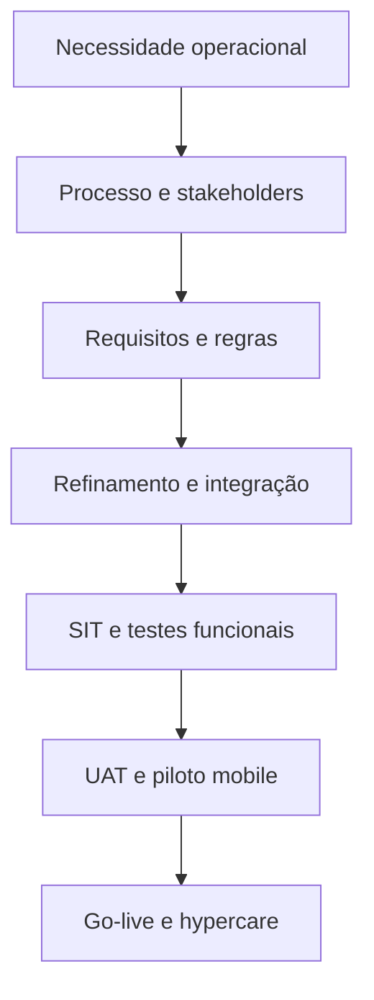

# 07. Mapa de evidências da atuação

[← Voltar ao README](../README.md)

## Propósito

Este mapa torna explícita a relação entre as competências demonstradas e os artefatos públicos do case. Ele substitui documentos internos por evidências reconstruídas e seguras.

| Competência | Como foi aplicada | Evidência neste repositório |
|---|---|---|
| Entendimento de negócio | Relacionar estoque em trânsito ao planejamento de embarque | [Contexto](01-business-context.md) |
| Mapeamento de processo | Organizar a jornada entre origem, pátio e terminal | [Jornada](02-driver-journey-and-requirements.md) |
| Requisitos | Transformar necessidades em comportamentos testáveis | [Requisitos funcionais](../examples/functional-requirements.md) |
| Regras de negócio | Definir elegibilidade, estados e exceções | [Regras](../examples/business-rules.md) |
| Integrações REST/JSON | Mapear eventos e responsabilidades entre sistemas | [Integrações](03-solution-and-integrations.md) |
| Qualidade | Planejar testes positivos, negativos e integrados | [Estratégia](04-quality-strategy.md) |
| Testes mobile | Validar fluxo em dispositivo e contexto reais | [Piloto](05-pilot-go-live-hypercare.md) |
| UAT | Conduzir aceite pela perspectiva da operação | [Checklist](../examples/uat-checklist.md) |
| QR Code | Validar emissão, estado, expiração e leitura | [Cenários](../examples/test-scenarios.csv) |
| Go-live / hypercare | Apoiar implantação, triagem e estabilização | [Go-live](05-pilot-go-live-hypercare.md) |
| Sustentabilidade | Relacionar digitalização a indicadores verificáveis | [Paperless](06-paperless-and-sustainability.md) |
| Confidencialidade | Demonstrar sem publicar ativos do cliente | [Disclaimer](../DISCLAIMER.md) |

## Linha de atuação

## Responsabilidade declarada

### Fiz

- análise, documentação e validação funcional;
- conexão entre negócio, operação e equipe técnica;
- desenho de cenários e critérios de aceite;
- testes de integração e experiência mobile;
- gestão de defeitos, retestes e homologação;
- acompanhamento da implantação e estabilização.

### Colaborei

- refinamentos técnicos;
- investigação de falhas ponta a ponta;
- priorização junto a operação e fornecedor;
- alinhamento de dados e eventos entre sistemas.

### Não reivindico

- autoria integral do código ou da arquitetura proprietária;
- propriedade da plataforma ou de sua interface;
- criação individual de todos os componentes;
- resultados numéricos não autorizados;
- acesso público a documentos internos.

## Roteiro de apresentação em entrevista

### Contexto

> O terminal precisava enxergar não apenas o estoque físico, mas também a carga comprometida e ainda em deslocamento, porque essa informação apoiava o planejamento logístico de embarque.

### Desafio

> A jornada envolvia motorista, transportadora, pátio regulado, terminal e sistemas diferentes. Era necessário transformar os marcos físicos em eventos confiáveis e, ao mesmo tempo, simplificar a experiência do motorista.

### Minha atuação

> Atuei desde o levantamento e as regras de negócio até o acompanhamento do desenvolvimento, validação das integrações, testes funcionais, SIT/UAT, piloto em celular corporativo, homologação, go-live e hypercare.

### Exemplo técnico

> Um ponto crítico foi o QR Code: ele não poderia ser tratado como uma imagem estática. A disponibilidade dependia da chamada do terminal, da elegibilidade do agendamento e do estado da jornada. Por isso testamos emissão, leitura, expiração, revogação, duplicidade e retorno do status entre os sistemas.

### Valor

> A solução ampliou a rastreabilidade da carga antes da chegada, centralizou informações e documentos no app e criou eventos úteis para operação e planejamento, com menor dependência de papel e contatos manuais.

## Frase de posicionamento

> Minha contribuição foi transformar uma necessidade operacional complexa em requisitos, integrações e critérios de qualidade que puderam ser homologados na jornada real do motorista.
